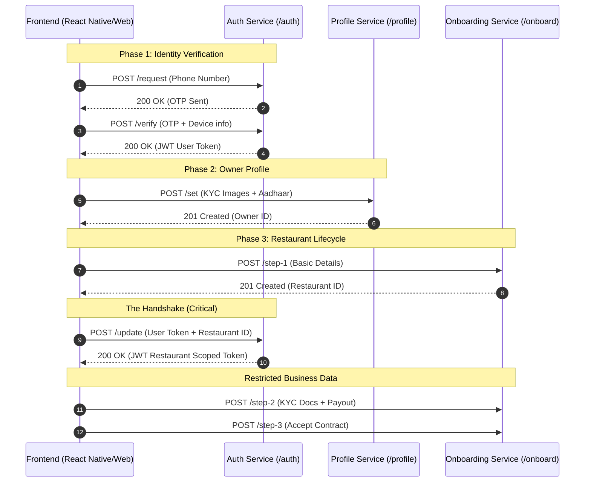
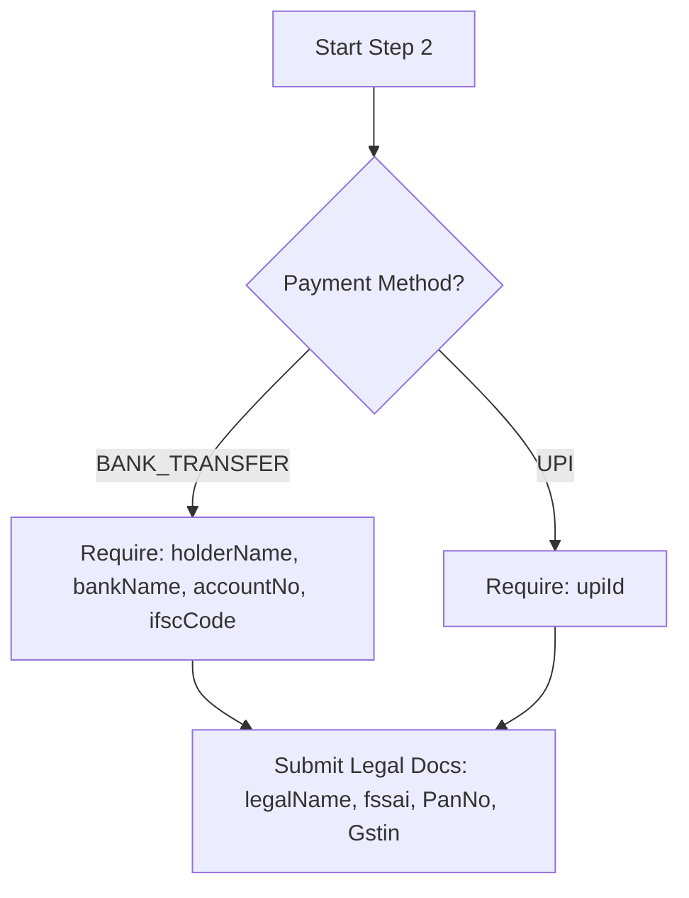

# Fudode Restaurant API - Authentication & Onboarding Guide

This document defines the **canonical** 3-phase onboarding flow for Restaurant Owners on the Fudode platform.

---

## 1. High-Level Flow Visualization

The platform uses a **Two-Tier Authentication** model to ensure data isolation.



---

## 2. Phase 1: Basic Authentication (`/restaurant/auth`)

### 2.1 Request OTP
`POST /restaurant/auth/request`
- **Body**: `{ "number": "9876543210" }`
- **Output**: `{ "status": true, "message": "OTP sent successfully" }`

### 2.2 Verify OTP
`POST /restaurant/auth/verify`
- **Body**:
  ```json
  {
    "number": "9876543210",
    "otp": "123456",
    "deviceId": "uuid-123",
    "deviceType": "ANDROID"
  }
  ```
- **Output**:
  ```json
  {
    "status": true,
    "accessToken": "eyJ...", // High-level User Token
    "refreshToken": "..."
  }
  ```

---

## 3. Phase 2: Owner Profile Setup (`/restaurant/profile`)

*Requires standard User Token.*

### 3.1 Set Owner Profile
`POST /restaurant/profile/set` | `PUT /restaurant/profile/update`
- **Format**: `multipart/form-data`
- **Fields**:
  - `name`: string
  - `email`: string
  - `alternateNo`: string (10 digits)
  - `aadhaarNo`: string (12 digits)
- **Files** (All mandatory for both creation and update):
  - `avatar`: Profile image
  - `aadhaarFront`: Document Image
  - `aadhaarBack`: Document Image
- **Output**: `{ "status": true, "profileData": { ... } }`

---

## 4. Phase 3: The 3-Step Onboarding Flow (`/restaurant/onboard`)

### Step 1: Basic Restaurant Identity
`POST /restaurant/onboard/step-1`
- **Token Type**: User Token
- **Body**:
  ```json
  {
    "name": "Pizza Palace",
    "alternateNo": "9876543210",
    "lat": 12.9716,
    "long": 77.5946,
    "area": "Indiranagar",
    "city": "Bengaluru",
    "shopno": "123",
    "floor": "Ground", // Mapped to 'tower' in backend
    "landMark": "Near Metro Station"
  }
  ```
- **Output**: `{ "status": true, "data": { "restaurantId": "RES_XYZ", ... } }`

### 🔄 The Transition (Crucial Step)
Before proceeding to Step 2, the frontend **must call** `/auth/update` to receive a token scoped specifically to the newly created `restaurantId`.

`POST /restaurant/auth/update`
- **Body**: `{ "refreshToken": "...", "deviceId": "...", "restaurantId": "RES_XYZ" }`
- **Output**: `{ "accessToken": "..." }` // **Restaurant Scoped Token**

---

### Step 2: KYC & Payout Logic
`POST /restaurant/onboard/step-2`
- **Token Type**: Restaurant Scoped Token



- **Exact Body Structure**:
  ```json
  {
    "legalName": "Business Name",
    "fssai": "14-digit number",
    "PanNo": "ABCDE1234F",
    "Gstin": "29ABCDE1234F1Z5",
    "paymentMethod": "BANK_TRANSFER" | "UPI",
    "holderName?": "...",
    "bankName?": "...",
    "accountNo?": "...",
    "ifscCode?": "...",
    "upiId?": "..."
  }
  ```

---

### Step 3: Contract Acceptance
`POST /restaurant/onboard/step-3`
- **Token Type**: Restaurant Scoped Token
- **Process**:
  1.  Call `GET /restaurant/onboard/get-partener-contract` to fetch the current draft.
  2.  Submit Acceptance:
      ```json
      {
        "contractId": "...",
        "contractVersion": "...",
        "contractAccepted": true
      }
      ```
---

## 5. Maintenance & Retrieval

### Get All My Restaurants
`GET /restaurant/get/my`  
Returns all restaurants owned by the current User Token.

### Check Onboarding Status
`GET /restaurant/onboard/get`  
Returns the current `onboardingStep` (1, 2, or 3) for the Restaurant Scoped Token.

---

## 6. Validation Constraints (Regex)

- **PAN**: `^[A-Z]{5}[0-9]{4}[A-Z]{1}$` (`PanNo` field)
- **GSTIN**: `^[0-9]{2}[A-Z]{5}[0-9]{4}[A-Z]{1}[0-9A-Z]{1}Z[0-9A-Z]{1}$` (`Gstin` field)
- **FSSAI**: `^[0-9]{14}$` (`fssai` field)
- **IFSC**: `^[A-Z]{4}0[A-Z0-9]{6}$` (`ifscCode` field)
