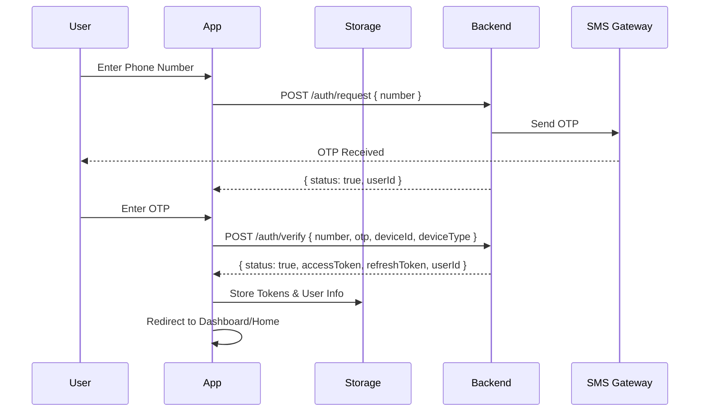
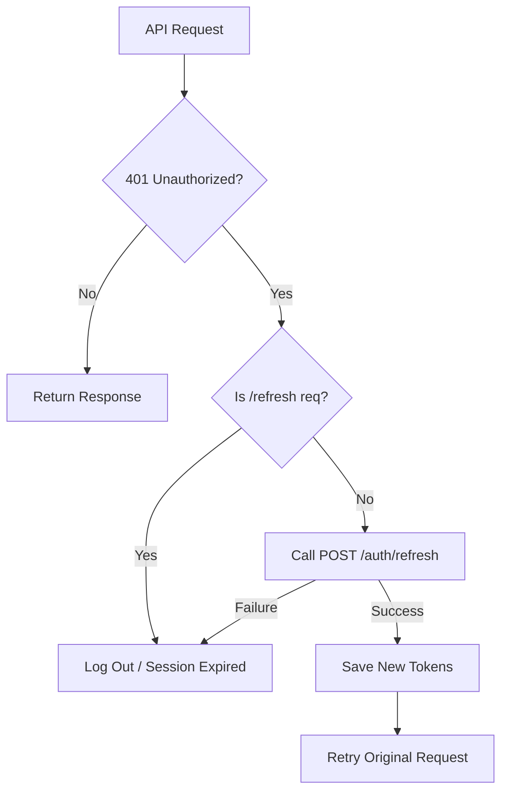
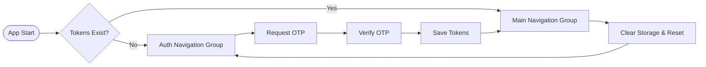

# Fudode Auth System: Frontend Implementation Guide

This guide provides a comprehensive blueprint for implementing the authentication system in the Fudode Frontend (React Native/Expo or Web). It is based on the backend's OTP-based authentication and JWT Refresh Token rotation architecture.

---

## 1. Authentication Architecture Overview

The system uses a **Dual-Token System**:
- **Access Token (JWT)**: Short-lived (e.g., 15 mins), used in the `Authorization: Bearer <token>` header.
- **Refresh Token**: Long-lived (e.g., 30 days), used to rotate both tokens when the access token expires.

### Key Flows
- **OTP Login**: Phone-based authentication via `POST /auth/request` and `POST /auth/verify`.
- **Silent Refresh**: Automatic renewal of tokens via Axios Interceptors before the user even knows it expired.
- **Session Management**: Each device has its own session (maximum 5 sessions per app).

---

## 2. Authentication Sequence Diagram

### Login & Verification Flow


---

## 3. Storage Strategy

For React Native (Expo), use `expo-secure-store` to ensure tokens are encrypted on disk.

```typescript
import * as SecureStore from 'expo-secure-store';

const AUTH_KEYS = {
  ACCESS_TOKEN: 'fudode_access_token',
  REFRESH_TOKEN: 'fudode_refresh_token',
  USER_DATA: 'fudode_user_data'
};

export const saveTokens = async (accessToken: string, refreshToken: string) => {
  await SecureStore.setItemAsync(AUTH_KEYS.ACCESS_TOKEN, accessToken);
  await SecureStore.setItemAsync(AUTH_KEYS.REFRESH_TOKEN, refreshToken);
};

export const getTokens = async () => {
  return {
    accessToken: await SecureStore.getItemAsync(AUTH_KEYS.ACCESS_TOKEN),
    refreshToken: await SecureStore.getItemAsync(AUTH_KEYS.REFRESH_TOKEN)
  };
};
```

---

## 4. Silent Token Refresh (Axios Interception)

The frontend should automatically handle 401 errors by calling the refresh endpoint.



### Axios Implementation Example

```javascript
import axios from 'axios';
import Constants from 'expo-constants';

const api = axios.create({ baseURL: 'YOUR_API_URL' });

api.interceptors.response.use(
  (response) => response,
  async (error) => {
    const originalRequest = error.config;

    if (error.response?.status === 401 && !originalRequest._retry) {
      originalRequest._retry = true;
      const { refreshToken } = await getTokens();
      const deviceId = Constants.sessionId; // Or a consistent UUID

      try {
        const response = await api.post('/auth/refresh', { refreshToken, deviceId });
        const { accessToken, refreshToken: newRefreshToken } = response.data;
        
        await saveTokens(accessToken, newRefreshToken);
        originalRequest.headers.Authorization = `Bearer ${accessToken}`;
        return api(originalRequest); // Retry with new token
      } catch (refreshError) {
        // Clear storage and redirect to login
        handleLogout();
        return Promise.reject(refreshError);
      }
    }
    return Promise.reject(error);
  }
);
```

---

## 5. State Management (AuthContext)

Wrap your app in an `AuthProvider` to manage global auth state.

```typescript
type AuthState = 'LOADING' | 'AUTHENTICATED' | 'UNAUTHENTICATED';

export const AuthProvider = ({ children }) => {
  const [state, setState] = useState<AuthState>('LOADING');
  const [user, setUser] = useState<any>(null);

  useEffect(() => {
    checkAuthStatus();
  }, []);

  const checkAuthStatus = async () => {
    const tokens = await getTokens();
    if (tokens.accessToken) {
      // Validate or fetch user profile
      setState('AUTHENTICATED');
    } else {
      setState('UNAUTHENTICATED');
    }
  };

  return (
    <AuthContext.Provider value={{ state, user, login, logout }}>
      {children}
    </AuthContext.Provider>
  );
};
```

---

## 6. Navigation Guard Pattern

In React Native with Expo Router, manage navigation based on auth state:



---

## 7. Best Practices & Security Checklist

> [!IMPORTANT]
> **Token Rotation**: The backend implements refresh token rotation (returning a new refresh token on every refresh call). Ensure you replace the stored refresh token with the new one every time.

- [ ] **Secure Storage**: Use `expo-secure-store` or Keychain/Keystore. Avoid `AsyncStorage` for tokens.
- [ ] **Request Timeout**: Set reasonable timeouts for OTP requests (e.g., 60s cooldown for resend).
- [ ] **Device ID Consistency**: Use a consistent UUID for `deviceId` to avoid creating orphaned sessions on the backend.
- [ ] **Optimistic Routing**: Don't wait for profile fetches if the token is present; navigate to the main app and show skeletons while profile loads.
- [ ] **Error Handling**: Differentiate between "Invalid OTP" (User error) and "Account Suspended" (Business logic error).
