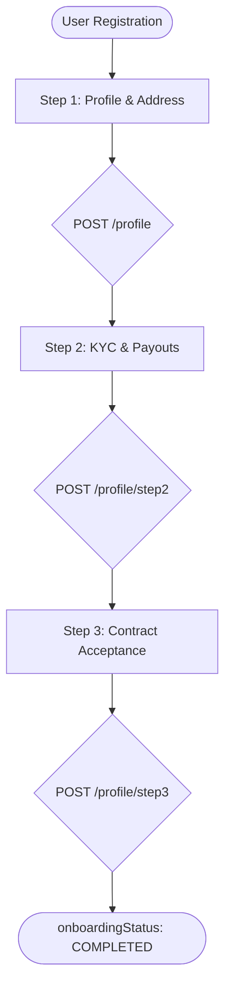

# Restaurant Onboarding: Complete Implementation Guide (Steps 1-3)

This guide provides a full walkthrough for implementing the restaurant onboarding flow, from initial profile creation to final contract acceptance.

---

## 1. Onboarding Overview
The onboarding process is divided into three distinct steps. A user must complete them in order:
1. **Step 1**: Basic Info & Shop Location
2. **Step 2**: KYC (Legal Docs) & Bank/Payout Details
3. **Step 3**: Digital Contract Acceptance

### Onboarding State Machine


---

## 2. Step 1: Basic Profile & Location
**Objective**: Create the restaurant record and associate it with the owner.

- **Endpoint**: `POST /profile` (Create) | `PUT /profile` (Update)
- **Data Payload**:
    ```json
    {
      "name": "The Great Pizza",
      "alternateNo": "9876543210",
      "lat": 12.9716,
      "long": 77.5946,
      "city": "Bengaluru",
      "area": "Indiranagar",
      "shopno": "12/A",
      "floor": "Ground Floor",
      "landMark": "Near Metro Station"
    }
    ```
- **Side Effects**: Automatically assigns the `RESTAURANT_OWNER` role to the user for this specific restaurant ID.

---

## 3. Step 2: KYC & Payout Details
**Objective**: Collect legal identifiers and banking information for settlements.

- **Endpoint**: `POST /profile/step2`
- **Data Payload**:
    ```json
    {
      "legalName": "Pizza Corp Pvt Ltd",
      "fssai": "12345678901234",
      "PanNo": "ABCDE1234F",
      "Gstin": "29ABCDE1234F1Z5",
      "paymentMethod": "BANK_TRANSFER", // or "UPI"
      "holderName": "John Doe",
      "bankName": "HDFC Bank",
      "accountNo": "50100123456789",
      "ifscCode": "HDFC0001234",
      "upiId": "owner@upi" // Only if method is UPI
    }
    ```
- **Constraint**: Requires `onboardingStep: 1` to be completed first.

---

## 4. Step 3: Contract Acceptance
**Objective**: Legally binding digital signature.

### 4.1 Fetch Contract
Before showing Step 3, the frontend must fetch the active contract.
- **Endpoint**: `GET /profile/contract`

### 4.2 Submit Acceptance
- **Endpoint**: `POST /profile/step3`
- **Data Payload**:
    ```json
    {
      "contractAccepted": true,
      "contractId": "UUID_FROM_GET_CONTRACT",
      "contractVersion": 2
    }
    ```
- **Metadata**: The backend automatically logs the IP address and User-Agent for this request.

---

## 5. Frontend Navigation Logic

The frontend should use the `onboardingStep` field returned from the login or `GET /profile/step1` to determine which screen to show the user upon login.

| `onboardingStep` | Current Status | Action |
| :--- | :--- | :--- |
| `0` or null | Initial | Show Step 1 (Profile Creation) |
| `1` | Step 1 Done | Show Step 2 (KYC & Payouts) |
| `2` | Step 2 Done | Show Step 3 (Contract) |
| `3` | All Done | Redirect to Merchant Dashboard |

### Guard Logic (Pseudocode)
```javascript
const OnboardingNavigator = () => {
  const { profile } = useProfile();

  switch(profile.onboardingStep) {
    case 1: return <Step2KYCScreen />;
    case 2: return <Step3ContractScreen />;
    case 3: return <Dashboard />;
    default: return <Step1ProfileScreen />;
  }
}
```

---

## 6. Pro-Tips for Implementation

> [!TIP]
> **Persistent State**: Always call `GET /profile/step1` (or equivalent) when the app opens to sync the `onboardingStep`. Do not rely solely on locally stored flags, as the user might change devices.

> [!IMPORTANT]
> **Image Uploads**: While Step 2 collects textual KYC data, ensure you have an image upload strategy for the actual FSSAI/PAN certificates if the backend expands to require document verification (using S3/Cloudinary).

> [!WARNING]
> **Step Locking**: If a user attempts to call `POST /profile/step3` while their step is still `1`, the backend will reject it with a `400 Bad Request`. Ensure your UI prevents "skipping" steps via deep-linking.
