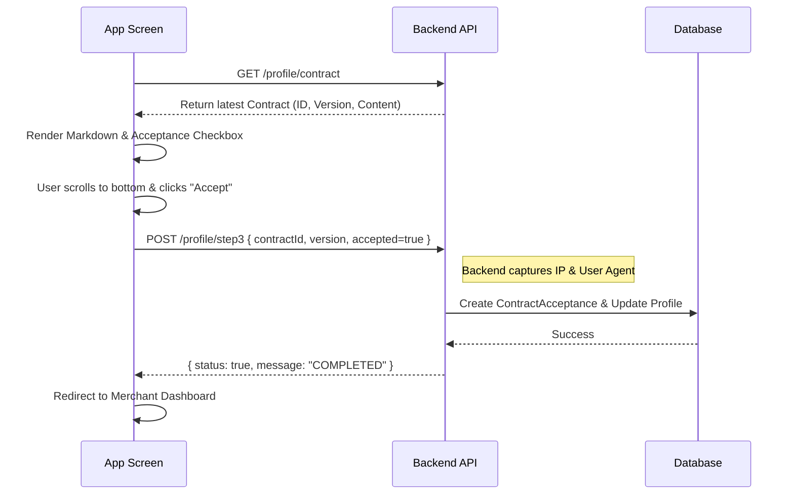

# Restaurant Onboarding: Step 3 Implementation Guide (Contract Acceptance)

This guide outlines the final step of the restaurant onboarding process: **Legal Contract Acceptance**. In this step, the restaurant owner reviews and signs the partner agreement digitallly.

---

## 1. Step 3 Objective
The goal is to ensure the partner has read and accepted the latest version of the platform's terms of service. Upon completion, the restaurant's `onboardingStep` is updated to `3` and its `onboardingStatus` becomes `COMPLETED`.

---

## 2. API Endpoints

### A. Fetch Active Contract
Before showing the UI, you must fetch the latest active contract content.
- **Endpoint**: `GET /profile/contract`
- **Response**:
```json
{
  "status": true,
  "data": {
    "id": "contract_uuid",
    "title": "Partner Agreement",
    "version": 2,
    "content": "# Markdown content of the agreement..."
  }
}
```

### B. Submit Acceptance
Submit the acceptance along with device metadata (automatically handled by the backend sanitization, but versioning must match).
- **Endpoint**: `POST /profile/step3`
- **Body**:
```json
{
  "contractAccepted": true,
  "contractId": "contract_uuid",
  "contractVersion": 2
}
```

### C. Verify Step Completion
Check if the user has already finished this step.
- **Endpoint**: `GET /profile/step3`

---

## 3. Implementation Flow

### Sequence Diagram


---

## 4. Frontend UI Requirements

### Mandatory Elements
1. **Markdown Renderer**: The `content` field is returned in Markdown. Use a library like `react-native-markdown-display` or `react-markdown`.
2. **Scroll-to-Read Validation**: (Recommended) Disable the "Accept" button until the user has scrolled to the bottom of the contract.
3. **Acceptance Form**:
    - A clear checkbox: "I agree to the terms and conditions".
    - A primary "Confirm & Complete Onboarding" button.

### Sample Code (React Native)

```javascript
const Step3Contract = () => {
  const [contract, setContract] = useState(null);
  const [isAccepted, setIsAccepted] = useState(false);

  useEffect(() => {
    // 1. Fetch Contract on Mount
    api.get('/profile/contract').then(res => setContract(res.data.data));
  }, []);

  const handleSubmit = async () => {
    try {
      const payload = {
        contractId: contract.id,
        contractVersion: contract.version,
        contractAccepted: true
      };
      
      const response = await api.post('/profile/step3', payload);
      if (response.data.status) {
        navigation.replace('Dashboard');
      }
    } catch (err) {
      Alert.alert("Error", err.response?.data?.message || "Something went wrong");
    }
  };

  if (!contract) return <LoadingSkeleton />;

  return (
    <ScrollView>
       <Text variant="h1">{contract.title}</Text>
       <Markdown>{contract.content}</Markdown>
       
       <Checkbox 
         label="I agree to the terms" 
         value={isAccepted} 
         onValueChange={setIsAccepted} 
       />
       
       <Button 
         disabled={!isAccepted} 
         onPress={handleSubmit}
         title="Finalize Onboarding"
       />
    </ScrollView>
  );
};
```

---

## 5. Security & Legal Considerations

> [!IMPORTANT]
> **Metadata Capture**: The backend automatically captures the `IP Address` and `User-Agent` string from the request headers. This is used for legal auditing. Ensure your frontend does not strip these headers.

> [!WARNING]
> **Step Locking**: If a user tries to access Step 3 before completing Step 2 (KYC/Profile), the API will return a `400 Bad Request`. Always verify the user's current `onboardingStep` before allowing them to enter this screen.

- **Idempotency**: The backend prevents duplicate acceptance of the same contract version. If `contractAlreadyAccepted` error occurs, redirect the user to the dashboard.
- **Versioning**: If the legal team updates the contract, the `version` will increment. The system may require existing users to re-accept the new version in the future.
